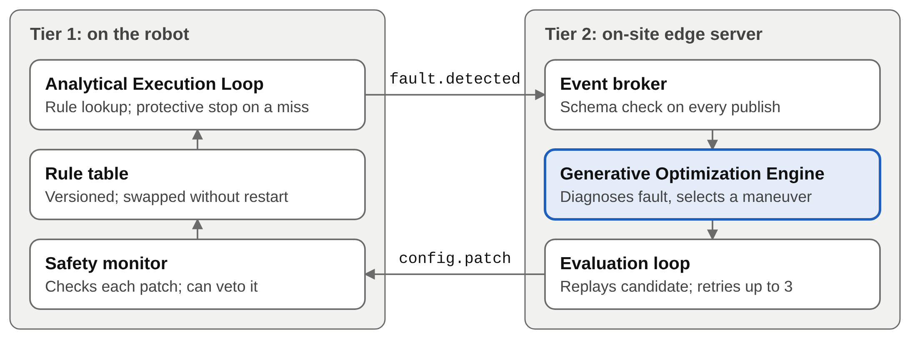

# Event-driven self-healing architecture: simulation code

Code and result files for the paper

> Nagaraju Akkuledu Uppara, Ayaskant Pattnaik, Gangadhara Raghu Kopparapu, Udaya Bhasker Mattupalli, ShravanKumar Arram, Pralav Prasun, "An Event-Driven Agentic AI Architecture for Autonomous Error Recovery and Self-Evolution in Goal-Oriented Embodied Warehouse Robots," submitted to the 19th IEEE MCSoC 2026 (EmbodiCore, track T6).

The simulation is a discrete-event model on a virtual clock. It illustrates the control flow of the
architecture: a deterministic rule-table loop on the robot, a fault event for anything the table does
not cover, an off-board generative engine that proposes a fix, and installation of an accepted fix
as a new rule.

**What this is not.** The generative engine is a mock, and every latency is sampled from a stated
distribution. Nothing here measures a real language model, a robot or a chip.

## Architecture

The design places computing in three tiers. Tier 1 is the robot, which runs a deterministic rule table. Tier 2 is an on-site edge server, which runs the generative engine and is reached only when the robot publishes a fault. Tier 3 is a private cloud used as an optional escalation path. An accepted fix from Tier 2 is installed as a new rule on the robot.



**This repository contains the simulation only. The technologies below describe a possible deployment. None of them is implemented or used here; the code uses only the Python standard library.**

| Component | Candidate technology | In this repository |
|---|---|---|
| Tier 1 robot controller | For example, a multicore Arm Cortex-A class system-on-chip running ROS 2, with motor control on a separate microcontroller | Simulated |
| Obstacle and person sensing | LiDAR and sonar for range; a camera-based detector for people | Simulated as event records |
| Tier 1 to Tier 2 link | Industrial Wi-Fi or private 5G | Not modeled |
| Event broker and messages | Apache Kafka or an MQTT broker; Protocol Buffers schemas | In-memory broker; JSON with the same checks |
| Tier 2 generative engine | Quantized 7- to 8-billion-parameter language model on an edge accelerator such as an NVIDIA Jetson, or on a server GPU | Mock engine |
| Tier 3 escalation | Larger cloud-hosted model, for example a vision-language-action model | Not evaluated |
| Safety monitor | Deterministic checks on the robot's safety controller | Catch probability only |

## Reproduce the paper

Python 3.9 or later. The simulator and the experiments use the standard library only.

```bash
python run_experiments.py          # about 15 s; writes results/*.csv
pip install matplotlib             # only needed for the figure
python make_figures.py             # writes results/fig2_fault_rate.png
```

| Paper item | File |
|---|---|
| Table III (policy comparison) | `results/experiment_summary.csv` |
| Section VI, stop time of faulted events | `results/fault_stop_time.csv` |
| Fig. 2 (fault rate over a run) | `results/fault_rate_curve.csv`, `results/fig2_fault_rate.png` |
| Table IV (wrong-fix sensitivity) | `results/sensitivity_summary.csv` |

Runs are deterministic: seeds 1 to 200, 500 events each, reproduce the files in `results/` exactly.

A single annotated run, one row per event:

```bash
python warehouse_robot_event_loop_autonomous.py --seed 42 --out results/500_synthetic_runs.csv --events-out results/synthetic_events.jsonl
```

## Verify results

**Quick smoke test** (5 seeds, ~1 s — checks the pipeline runs without errors):

```bash
python run_experiments.py --seeds 5
```

**Full reproduction** (200 seeds, ~15 s — output should match `results/` exactly):

```bash
python run_experiments.py
python make_figures.py
```

**Check expected output files exist after a full run:**

```bash
ls results/experiment_summary.csv
ls results/fault_stop_time.csv
ls results/fault_rate_curve.csv
ls results/sensitivity_summary.csv
ls results/fig2_fault_rate.png
```

**Compare against committed results** (bit-exact on CPython 3.9+):

```bash
python run_experiments.py
git diff results/
```

`git diff` should show no changes if the reproduction is exact. Any diff indicates a Python version or platform difference.

## Files

- `warehouse_robot_event_loop_autonomous.py`: event broker with schema validation, the analytical loop, the mock
  generative engine and its evaluation loop, and all parameters (`SimConfig`).
- `run_experiments.py`: the four policies, the 200-seed comparison, the fault-rate curve and the
  wrong-fix sensitivity sweep.
- `make_figures.py`: draws Fig. 2.
- `results/`: outputs of the commands above, as used in the paper.

## Policies

| Name | Behavior |
|---|---|
| `rules_only` | Shipped rule table; a miss ends in a protective stop and an operator handoff |
| `generative_all` | Every event goes to the generative engine |
| `heal_no_learn` | Faults go to the engine, but accepted fixes are not installed as rules |
| `proposed` | Faults go to the engine, and accepted fixes are installed as rules |

## Sensitivity parameters

`wrong_fix_p` (share of wrong candidates), `eval_catch_p` (evaluation loop catch rate, 0.80) and
`monitor_catch_p` (on-robot monitor catch rate, 0 or 0.90) are assumptions chosen to show the
mechanism. They are not measurements.

## AI assistance

The code was written with the help of an AI assistant (Claude, Anthropic) and reviewed by the author.
